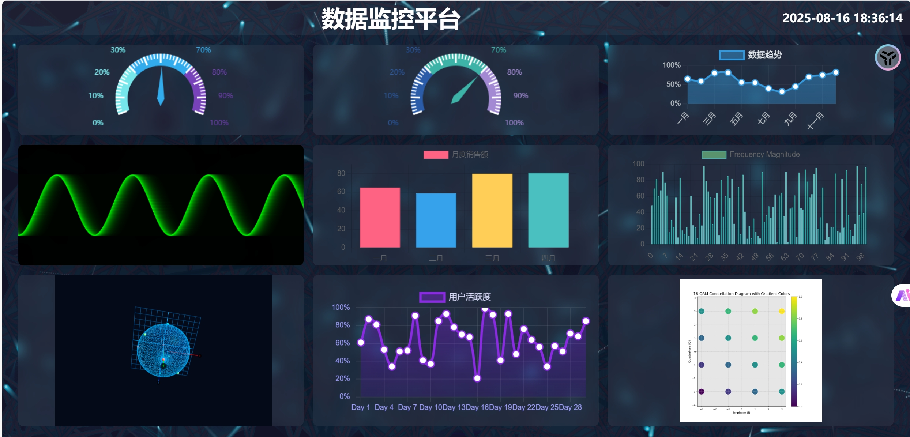

# Admin Index

这是一个基于Python的Web管理界面项目，提供了直观的仪表盘视图，包含多种数据可视化功能。

## 功能特点

- 提供了主页、新主页和星座页面等多个视图
- 使用Three.js实现了3D球体可视化
- 使用ECharts实现了图表可视化
- 包含粒子动画背景效果

## 安装依赖

- Python 3.x
- Flask
 -numpy
 -matplotlib
- ECharts
- Three.js
- chart.js
- echarts.min.js
- jQuery.min.js
- OrbitControls.js

## 使用方法

1. 安装所有依赖
2. 运行App.py启动服务
3. 访问主页查看可视化效果

## 页面说明

- 首页: 显示主要仪表盘视图
- 新首页: 显示新设计的仪表盘布局
- 星座页面: 显示星座相关的可视化内容

## 组件说明

### 前端组件

- **Three.js**: 用于创建和操作3D球体
- **ECharts**: 用于创建数据图表
- **粒子背景**: 在后台显示动态粒子效果
- **jQuery**: 提供DOM操作和事件处理支持

### 页面布局

- **头部**: 显示标题和时间信息
- **容器**: 包含左侧信息面板、右侧3D可视化区域和中间行控制组件
- **控制组件**: 包含旋转控制和重置视图按钮

## 控制功能

- 鼠标左键拖动: 旋转3D球体
- 鼠标右键拖动: 平移视图
- 鼠标滚轮: 缩放视图
- 点击"旋转"按钮: 开始或停止球体自动旋转
- 点击"重置"按钮: 将视图恢复到初始状态

## 许可证

本项目使用MIT License，请参阅LICENSE文件获取详细信息。